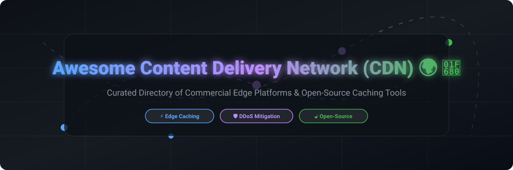

# Awesome-Content-Delivery-Network-CDN

# Awesome-Content-Delivery-Network-CDN 🌍 🚀



  





  
  
  
  
  
  



---

## 🌟 Top Content Delivery Network (CDN) Ecosystem

**Curated List of Commercial CDN Platforms & Open-Source Edge Caching Tools**  
*Focused on Global Edge Caching, Edge Compute, DDoS Mitigation, Image/Video Optimization, Multi-CDN Orchestration & Self-Hosted CDN Solutions*

**Last updated: October 2026** 📅

---

### 📌 Overview & SEO Summary
Welcome to the ultimate curated directory of **content delivery network platforms**, **open-source CDN software**, and **edge computing frameworks**. Whether you are looking for enterprise-grade commercial solutions (such as *Cloudflare*, *Fastly*, and *Akamai*), or self-hostable open-source alternatives (like *Varnish Cache*, *Apache Traffic Server*, and *Nginx*), this list covers category leaders, edge compute, and privacy-respecting content delivery.

**Key Market Context:**
- **Cloudflare** serves **~20% of all websites** and provides **unmetered DDoS protection, free SSL, and a global anycast network** on its free tier.
- **Fastly** powers **Stripe, GitHub, and Shopify** with **instant purge, edge compute (Compute@Edge), and VCL customization**.
- **Bunny.net** offers **premium CDN at $0.01/GB** — among the cheapest in the market, with **no minimum commitment**.
- **Varnish Cache** remains the **most widely deployed open-source HTTP accelerator**, with **built-in VCL, ESI support, and edge-side includes**.

---

## 📑 Table of Contents
- [🏢 SaaS & Commercial Platforms](#-saas--commercial-platforms)
- [🔓 Open-Source GitHub Projects](#-open-source-github-projects)
- [🛠️ How to Contribute](#%EF%B8%8F-how-to-contribute)
- [📊 Star History](#-star-history)
- [🤝 Support & Sponsorship](#-support--sponsorship)
- [⚠️ Disclaimer](#%EF%B8%8F-disclaimer)

---

## 🏢 SaaS / Commercial Platforms

The CDN market spans **free/freemium platforms** (Cloudflare) that provide **global DDoS protection, free SSL, and basic CDN at no cost**, **premium CDNs** (Fastly, Akamai) that offer **advanced edge compute, instant purge, and enterprise SLAs**, and **budget CDNs** (Bunny.net, KeyCDN) that focus on **low-cost bandwidth with no minimum commitments**. **Cloudflare** offers **free CDN, DDoS protection, and SSL** on all plans . **Fastly** charges **$0.12/GB in North America** with **100 GB free bandwidth monthly** . **Akamai** uses **custom enterprise pricing** with **no public rates** . **Bunny.net** charges **$0.01/GB** for standard CDN with **volume discounts** . **KeyCDN** charges **$0.04/GB** with **pay-as-you-go pricing** . **Google Cloud CDN** charges **$0.08/GB for North America** and **$0.05/GB for Asia** . **Amazon CloudFront** charges **$0.085/GB for the first 10 TB** in North America.

| SaaS / Commercial Platform | Company / Owner | Valuation / Market Cap | Standard Edition Starting Price | Free Tier / Free Trial Limits | Description |
| :--- | :--- | :--- | :--- | :--- | :--- |
| **[Amazon CloudFront](https://aws.amazon.com/cloudfront/)** ☁️ | Amazon | ~$2.0 Trillion | **$0.085/GB** (first 10 TB, North America)  | **Free tier: 1 TB transfer + 10M requests/month for 12 months**  | **AWS-native CDN** — **450+ edge locations** in **90+ cities across 40+ countries** . **Lambda@Edge and CloudFront Functions** for edge compute . **Origin Shield** for reduced origin load . **Field-level encryption** and **signed URLs/cookies** . **Deep integration** with S3, EC2, and Shield Advanced . |
| **[Cloudflare CDN](https://www.cloudflare.com/)** 🟠 | Cloudflare Inc. | ~$30 Billion (Public) | **Free tier: unlimited CDN, DDoS protection, SSL**; **Pro: $20/month**  | **Free forever: unlimited bandwidth, DDoS protection, SSL**  | **The most widely deployed CDN** — serves **~20% of all websites** . **Global anycast network** with **330+ cities** . **Unmetered DDoS protection** and **free SSL** on all plans . **Workers** for edge compute . **R2** for zero-egress object storage . **The best free CDN in the market** . |
| **[Fastly](https://www.fastly.com/)** 🟣 | Fastly Inc. | ~$1 Billion (Public) | **$0.12/GB** (North America); **100 GB free bandwidth/month**  | **100 GB free bandwidth/month**  | **Edge cloud platform** — **Instant purge** (<150ms globally) . **VCL** for edge customization . **Compute@Edge** for WebAssembly edge compute . **Image Optimizer** for real-time image optimization . **Powers Stripe, GitHub, Shopify, and the New York Times** . **The developer's CDN** . |
| **[Akamai CDN](https://www.akamai.com/)** 🔴 | Akamai Technologies | ~$15 Billion (Public) | **Custom enterprise pricing**  | **No free tier**; **demo available** | **The original CDN** — **4,100+ edge locations** in **135+ countries** . **Ion** for performance, **Kona** for security, **EdgeWorkers** for edge compute . **The most mature and reliable CDN** — powers **Apple, Microsoft, and major banks** . |
| **[Imperva CDN](https://www.imperva.com/)** 🛡️ | Imperva (Thales) | ~$3 Billion | **Custom enterprise pricing**  | **Free trial available** | **Security-first CDN** — **DDoS mitigation, WAF, and bot protection** integrated . **Global network** with **edge caching** . **Used by enterprises for security-critical applications** . |
| **[Bunny.net](https://bunny.net/)** 🐰 | Bunny.net | Private | **$0.01/GB** (Standard CDN)  | **$1 free trial credit**  | **Budget CDN** — **The cheapest premium CDN** . **No minimum commitment**, **pay-as-you-go**. **Global network** with **edge storage and edge scripting** . **The best price-performance CDN** . |
| **[Edgio](https://edg.io/)** ⚡ | Edgio (formerly Limelight) | ~$200 Million | **Custom pricing**  | **Free trial available** | **Edge-enabled platform** — **CDN, edge compute, and security** . **Used by media and entertainment companies** for video delivery . |
| **[StackPath](https://www.stackpath.com/)** 📦 | StackPath | Private | **$0.05/GB** (starting)  | **Free trial available** | **Edge computing platform** — **CDN, WAF, and edge compute** . **Simple, predictable pricing** . |
| **[KeyCDN](https://www.keycdn.com/)** 🔑 | KeyCDN | Private | **$0.04/GB** (pay-as-you-go)  | **Free trial available**  | **Simple and affordable CDN** — **No minimum commitment**. **Global network** with **25+ points of presence** . **Real-time analytics and API** . **The easiest CDN to get started** . |
| **[Google Cloud CDN](https://cloud.google.com/cdn)** 🌐 | Google (Alphabet) | ~$2.0 Trillion | **$0.08/GB** (North America); **$0.05/GB** (Asia)  | **$300 free credits** for new customers  | **GCP-native CDN** — **Google's global edge network** with **Cloud Load Balancing** . **Cloud CDN** for caching. **Media CDN** for streaming. **Cloud Armor** for DDoS protection . |

---

## 🔓 Open-Source GitHub Projects

*Sorted by GitHub_Stars_Count (Descending)* 🌟

- **[Varnish Cache](https://github.com/varnishcache/varnish-cache)**   
  **The most widely deployed open-source HTTP accelerator**, BSD-2-Clause licensed. **The gold standard for self-hosted CDN caching** — **Varnish Configuration Language (VCL)** for flexible caching policies . **ESI (Edge Side Includes)** for dynamic content assembly . **Built-in load balancing and health checks** . **Grace mode** for serving stale content during backend failures . **The most performant open-source HTTP cache** — used by **Facebook, Wikipedia, and The New York Times** . **The backbone of most self-hosted CDN architectures** . 🚀

- **[Apache Traffic Server](https://github.com/apache/trafficserver)**   
  **High-performance HTTP/1.1 and HTTP/2 compliant caching proxy server**, Apache-2.0 licensed. **Formerly Inktomi Traffic Server** — **Yahoo's production CDN** . **Handles millions of requests per second** . **Pluggable architecture** for custom caching, routing, and logging . **DNS cache, reverse proxy, and forward proxy** capabilities . **The most scalable open-source CDN server** — used by **Comcast, LinkedIn, and Verizon** . 🏛️

- **[Nginx](https://github.com/nginx/nginx)**   
  **High-performance web server and reverse proxy**, BSD-2-Clause licensed. **The most widely deployed web server** — **33% of all websites** . **Caching, load balancing, and reverse proxying** built-in . **Lua module (OpenResty)** for edge scripting . **The foundation for most self-hosted CDN stacks** . **The simplest way to add caching to any application** . 🟢

- **[OpenResty](https://github.com/openresty/openresty)**   
  **Web platform based on Nginx and LuaJIT**, BSD-2-Clause licensed. **Nginx + Lua = programmable CDN** . **Edge compute with Lua** — rewrite, route, and cache with custom logic . **OpenResty Edge** for enterprise CDN management . **The most powerful open-source edge scripting platform** . 🐉

- **[Caddy](https://github.com/caddyserver/caddy)**   
  **Extensible web server with automatic HTTPS**, Apache-2.0 licensed. **The easiest web server to configure** — **automatic HTTPS with Let's Encrypt** . **HTTP/3 support**, **reverse proxy**, and **caching** . **JSON config and API** for automation . **The simplest CDN edge server** . 🔒

- **[HAProxy](https://github.com/haproxy/haproxy)**   
  **The world's fastest and most widely used software load balancer**, GPL-2.0 licensed. **The standard for load balancing and reverse proxying** . **Caching, compression, and connection pooling** . **The foundation for high-availability CDN architectures** . 🏆

- **[Traefik](https://github.com/traefik/traefik)**   
  **Cloud-native application proxy**, MIT licensed. **Automatic service discovery** — Kubernetes, Docker, and Consul integration . **Let's Encrypt SSL**, **middleware for caching and rate limiting** . **The standard reverse proxy for Kubernetes** . 🚦

- **[Varnish Modules (VMODs)](https://github.com/varnish/varnish-modules)**   
  **Collection of Varnish modules**, BSD-2-Clause licensed. **Extends Varnish with additional functionality** — **geo-location, header manipulation, and caching policies** . **The standard extension library for Varnish** . 🧩

- **[CDN-Up](https://github.com/cdn-up/cdn-up)**   
  **Self-hosted CDN with image optimization**, open-source. **Upload, optimize, and serve images from your own infrastructure** . **WebP and AVIF conversion**. **The simplest self-hosted image CDN** . 🖼️

- **[Statically](https://github.com/staticallyio/statically)**   
  **Free CDN for open-source projects**, open-source. **Serves GitHub, GitLab, and Bitbucket assets** . **Used by thousands of open-source projects** . **The simplest way to add a CDN to open-source projects** . 📦

- **[MinIO](https://github.com/minio/minio)**   
  **High-performance S3-compatible object storage**, AGPL-3.0 licensed. **45K+ GitHub stars** — **the standard self-hosted S3 replacement** . **Ideal as a CDN origin** for static assets, images, and videos . **Erasure coding, encryption, and versioning** . **The most popular open-source object storage** . 🎯

---

## 🛠️ How to Contribute

Contributions are welcome! Follow these steps to submit new CDN platforms or open-source edge caching software:

1. 🍴 **Fork** the repository.
2. 📝 **Add/edit** entries in `README.md` maintaining table/list structure and formatting.
3. 🔗 Include project title, official website/GitHub link, exact Stars_Count, license, and brief description.
4. 🚀 Submit a **Pull Request** with a descriptive summary of your changes.

---

## 📊 Star History



---

## 🤝 Support & Sponsorship

If you find this CDN repository useful, please consider supporting the project:

- ⭐ **Star** this repository to increase visibility!
- 🔀 **Fork** and share with fellow DevOps engineers, platform teams, and open-source advocates.
- ☕ **Sponsor & Buy Me a Coffee**: Support ongoing open-source curation via the [GitHub Sponsor Dashboard](https://github.com/sponsors/ishandutta2007).

---

## ⚠️ Disclaimer

- This is a **community-curated** list — not exhaustive and not an endorsement. ℹ️
- **Cloudflare offers the best free CDN** — **unlimited CDN, DDoS protection, and SSL** on the free tier . **Fastly charges $0.12/GB** but offers **100 GB free bandwidth monthly** and **instant purge** . **Bunny.net at $0.01/GB** is the **cheapest premium CDN** .
- **AWS CloudFront, Google Cloud CDN, and Akamai** are **consumption-based** — costs scale with **data transfer and requests** . **Model your traffic patterns** before committing.
- **Open-source CDN tools (Varnish, Traffic Server, Nginx) are not turnkey** — they require **deployment, configuration, and ongoing maintenance** . **Varnish requires careful VCL design** . **Traffic Server requires deep operational expertise** . **Always validate caching behavior and performance with a proof-of-concept** before production deployment . 🌍

---



  <b>Made with ❤️ for DevOps engineers, platform teams, and open-source CDN advocates.</b>

